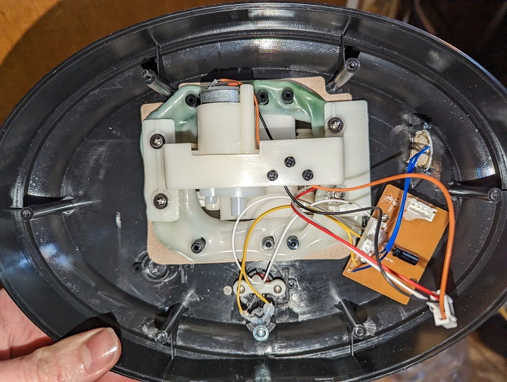

# TalkingFish

Documentation of the project:
----

Used Parts:
----
Arduino Pro Mini 168 5V    
DF Player Mini    
Motor drive module DAYPOWER Motor-9110    
CO2 Sensor: TFA Dostmann AirControl Mini CO2 Meter TFA 31.5006    

Understand the original setup
----

The fish uses two motors to move. One is opening and closing the mouth. The other one is moving the head and the tail.    
   

----

Motor 1:
Open mouth: White cable  (+) Red cable    (-) 

Motor 2:
Move head:  Orange cable (+) Black cable  (-) 
Move back:  Black cable  (+) Orange cable (-)

----
