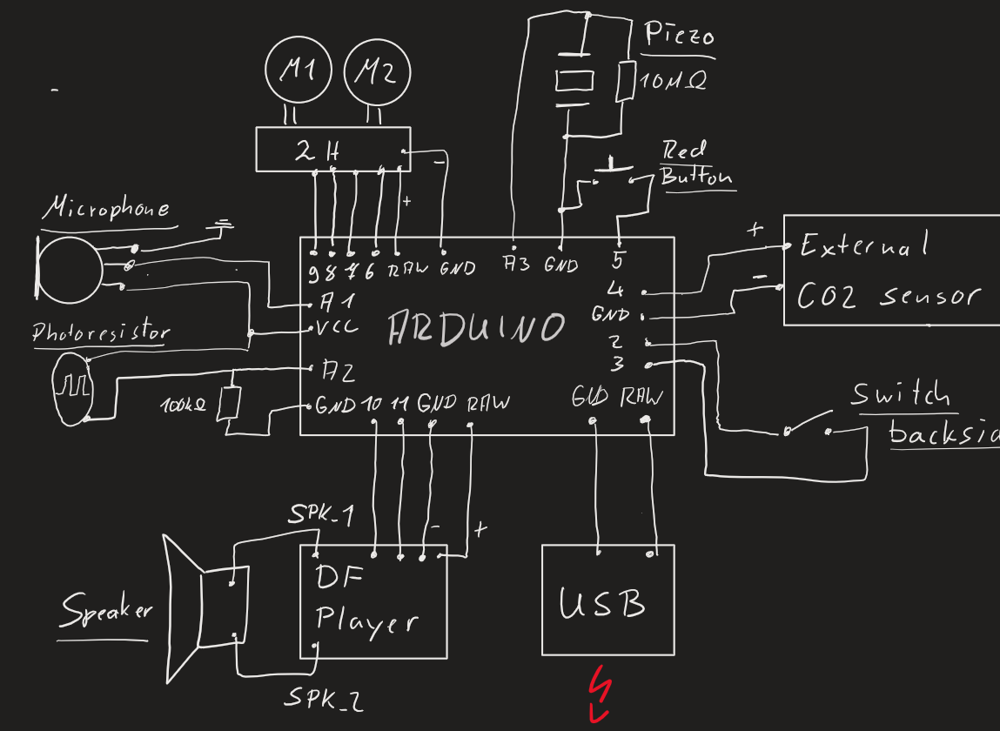

# TalkingFish

Documentation of the project:
----
The idea was to have the billy bass fish integrated in the CO2 monitoring system so that it can trigger an accoustic alarm everytime the air quality gets in a critical state. Since the fish contained other elements like a button, a photodiode and a piezo element it was an additional goal to reuse as much of the existing electronics as possible:    
   

Used Parts:
----
- Billy Bass fish
- Arduino Pro Mini 168 16MHz 5V    
- DF Player Mini with an SD card    
- Motor drive module DAYPOWER Motor-9110    
- CO2 Sensor: TFA Dostmann AirControl Mini CO2 Meter TFA 31.5006    
- Microphone
- Micro usb connector

Understand the original setup
----

The fish uses two motors to move. One is opening and closing the mouth. The other one is moving the head and the tail.    
There is also a piezo element connected to the blue wires which we guess will return a buzzing sound if the battery gets on a critical level.
The yellow cables are connected to a photoresistor which will detect a change of the lightning.
The white cables are connected to the button on the front which will usually trigger the movement of the fish. 
Also on the removed back there is a switch for enabling the photoresistor and a speaker.
Since it would be waste to not use these parts we decided to reuse all of the components
   

Additional setup
----
To add some extra features we decided to add a microphone to the front. 
It will be used to trigger a sound if conversations in the room get too loud or to detect a person clapping to wake everyone up.

Features
----

The fish supports 7 different scenarios which trigger different sounds and actions:    
- scenario 1: Red button pressed
  Triggers a "help me" sound
  
- scenario 2: Someone walking by and changing the value of the photodiode
  Triggers a "Keep on walking" sound
  
- scenario 3: Touching the fish and activating the piezo element
  Triggers a "Cant touch this" sound.

- scenario 4: An incoming signal on the alert pin from the CO2 monitoring system
  Triggers an "Alert" sound to open the windows
  
- scenario 5: Microphone detects too much noise over the last two minutes:
  Triggers a "Shut up I cant work sound"
  
- scenario 6: Microphone detects two claps:
  Triggers a screaming goat sound
  
- scenario 7: The switch on the backside is activated:
  Activates different sounds for all the above mentioned scenarios

Schematics
----
   

Motor cables
----
Motor 1:    
Open mouth: White cable  (+) Red cable    (-)   
Open mouth: White cable  (-) Red cable    (+)   
Motor 2:    
Move head:  Orange cable (+) Black cable  (-)    
Move back:  Black cable  (+) Orange cable (-)    

Co2 sensor connection
----
To connect the CO2 sensor we used the buzzer signal port like drawn in the schematic.
As soon as the critical level is hit the output will return a periodic signal which can be interpreted by the arduino.
This triggers the alarm and is afterwards ignored for a configured amount of time.
   

Finsished result
----
Here you can see the finished chaos inside of the fish.
The component on the backside are deplugable.
  
